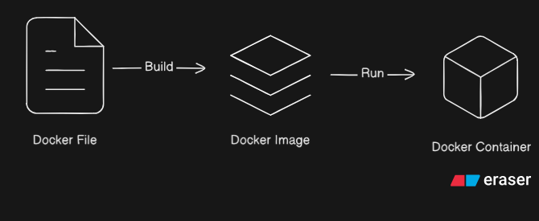

<h1>Day 1</h1>

<!-- Table of content -->
<h2>Table of contents</h2>
<b>
<ol>
<li> Introduction to Docker</li>
<li> Core Docker Components
    <ul> 
    <li>Docker
    <li> Docker Images</li>
    <li> Docker Container </li>
    </ul>
</li>
<li> Docker Image Registry
    <ul>
    <li>Public Registries
    <li>Private Registries
    </ul>
<li>Virtualization Concept
    <ul>
    <li> Docker vs VIrtual Machines</li>
    </ul>
<li>Docker Architecture
    <ul>
    <li>Docker client(CLI)
    <li>Docker host
    <li>Docker Daemon
    </ul>
<li>Why use Docker ?
    <ul>
    <li>Traditional Deployment challenges
    <li>Deployment with containers
    </ul>
<li>common Docker Commands
</ol>
</b>
<!-- Introduction to Docker -->

<h2>Introduction to Docker</h2>
<ol>
    <li>Definition
        <ul>
            <li>open source containerization platform
            <li>Automates deployment,scaling,and management of applications
            </ul>
    </li>
    <li>Containers:
        <ul>
            <li>lightweight, portable,isolated execution environment
            <li>include application code, runtime,libraries,dependencies
        </ul>
    </li>
    <li>Benefits:
        <ul>
            <li>Simplifies development & deployment
            <li>Eliminates environment mismatch
            <li>portable artifacts for sharing
</ol>
<!-- core components of Docker -->
<h2>Core components of Docker</h2>

<ol>
    <li> Dockerfile
        <ul>
            <li>Text File containing instructions to build docker images.</>
            <li>
            Specifies:
                <ul>
                    <li>Base image
                    <li>Dependencies
                    <li>Environment Variables
                    <li>Commands to runn
                </ul>
            </li>
        </ul> 
    <li>Docker Image
    <ul>
        <li>Read-only template containing application + dependencies
        <li>Snapshot of application's filesystem
        <li>Used to create container
    </ul>
    </li>    
     
    <li>
    Docker container
        <ul>
            <li>Running instance of a Docker image
            <li>Lightweight,isolated,portable
            <li>Can be:
                <ul>
                    <li>Started
                    <li>Stopped
                    <li>Restarted
                    <li>Deleted
                </ul>
            </li>
             
        </ul>
    </li>
    
     
    <h2> 3.Docker Image Registry</h2>
    <ol>
        <li>
        Definition
        </li>
            <ul>
                <li>Docker image Registry is a central location where Docker Images are stored and shared. It serves as a registry for docker Images allowing users to upload ,download,and manage images. The Repository provides a convenient way to distribute and access docker images across different systems and environment.
                </li>
            </ul>
            <li>Types of Registries
                <ol>
                    <li>Public Registry
                        <ul>
                        <li>Images can be accessed over the internet by anyone.
                        </ul>
                    <li>Private Registry
                        <ul>
                        <li>Images can be only accessed by authorized users.
                </ol>
            </li>
            <li>Example of Registries
                <ul>
                    <li>Docker Hub
                    <li>Amazon ECR
                    <li>Azure ACR
                    <li>Quay
                    <li>Google GCR
                    <li>Harbour
                </ul>
            </li>
    </ol>
    <h3>Virtualization Concepts</h3>
        <ol>
            <li>Virtualization</li>
            <ul>
                <li>Allows multiple isolated systems to run on a single physical machine
                <li>better resource allocation
            </ul>
            <li>Docker Vs Virtual Machine</li>
        </ol>
        <ol>
            <li>Virtualization
                <ul>
                    <li>Allows running isolated virtual servers on a single on a single physical machine
                    <li>Each VM has:
                        <ul>
                            <li>its own guest operating system
                            <li>Virtualization CPU,memory,storage,and network
                        </ul>
                    <li>Characteristics
                        <ul>
                            <li>Heavyweight
                            <li>Slower to start
                            <li>Higher resource usage
                        </ul>
                       <li> Example: Cloud VM instance
                </ul>
            <li>Docker (Containerization)
                <ul>
                    <li>Runs application
                    <li>Each containers include:
                </ul>
        </ol>
</ol>