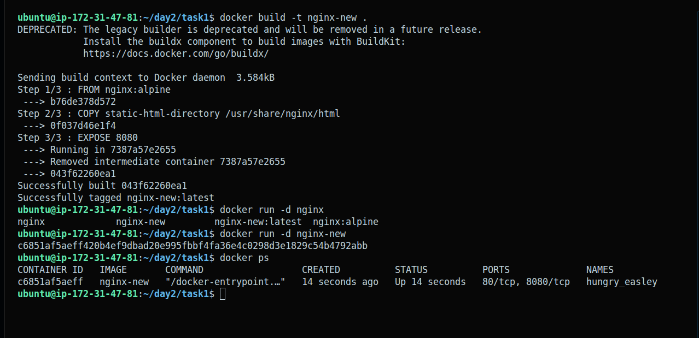
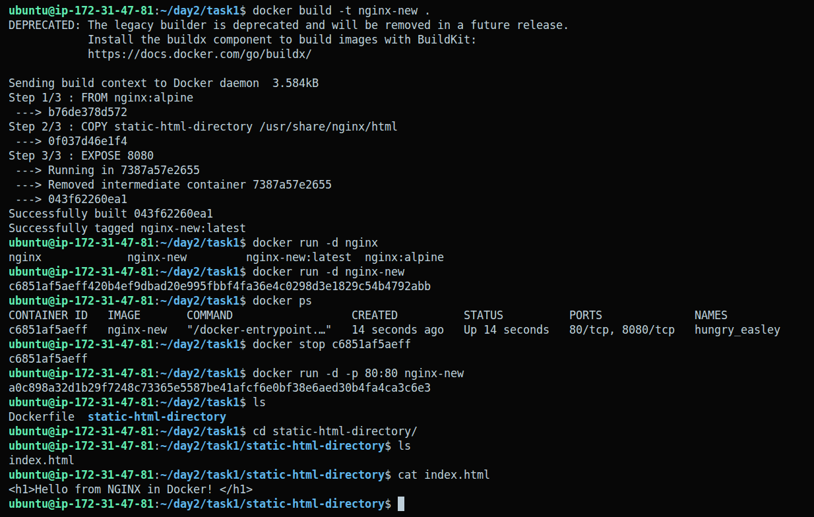
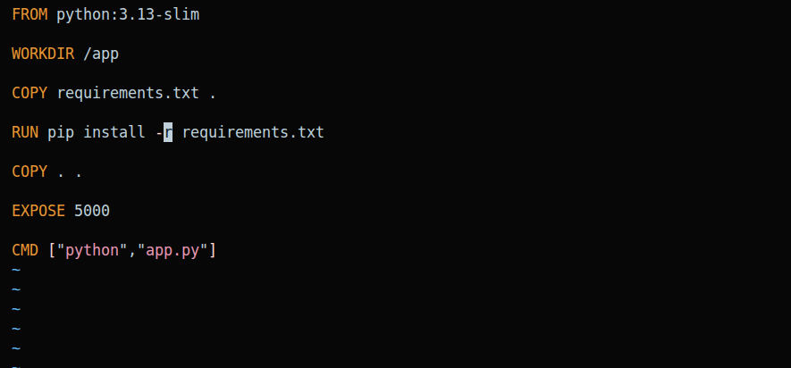
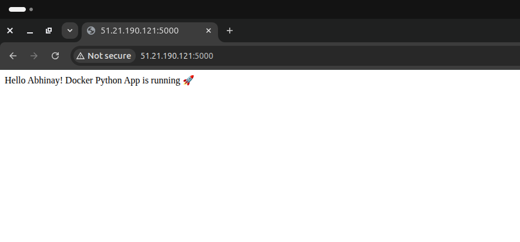
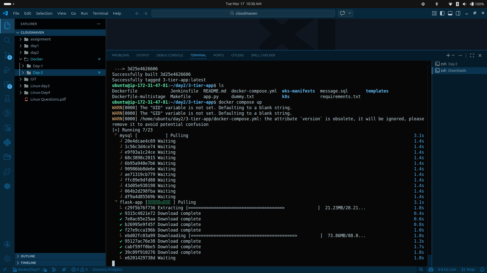
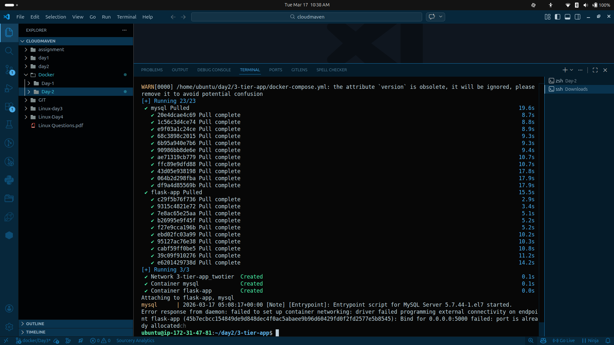
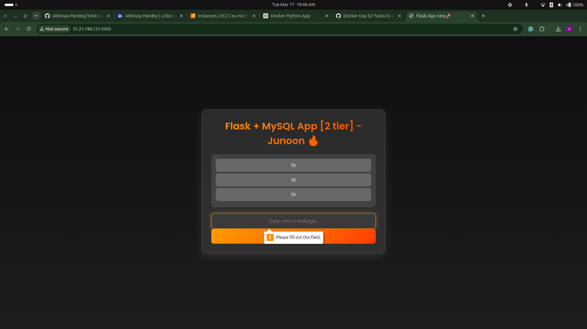
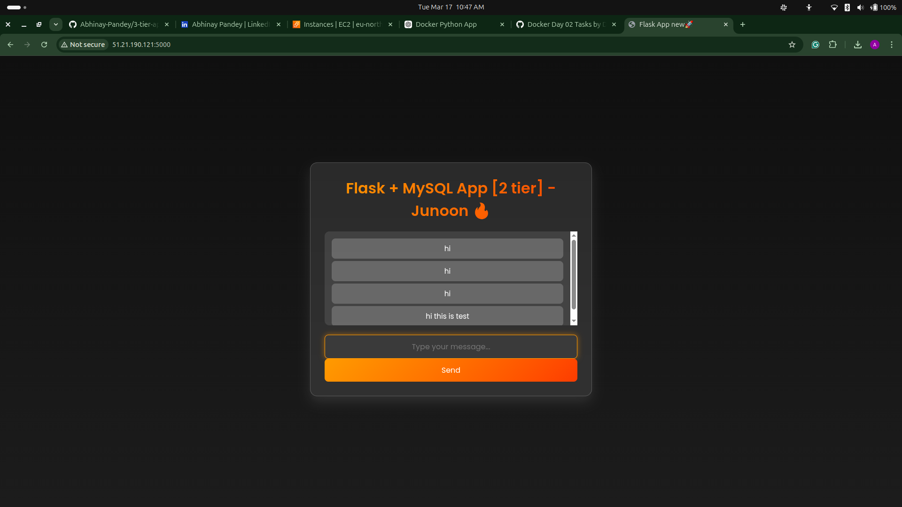

# 🐳 Docker Day 2 — Multi-Tier App with Compose

> **Project:** Flask + MySQL 2-Tier App — *Junoon 🔥*
> **Stack:** Python Flask · MySQL · NGINX · Docker Compose
> **Deployed on:** AWS EC2 (eu-north-1)

---

## 📁 Project Structure

```
3-tier-app/
├── Dockerfile              # Flask app image
├── Dockerfile-multistage   # Multistage build variant
├── docker-compose.yml      # Orchestrates all services
├── app.py                  # Flask application
├── requirements.txt        # Python dependencies
├── message.sql             # DB init script
├── templates/              # HTML templates
├── eks-manifests/          # Kubernetes manifests (future)
├── k8s/                    # K8s configs
└── Jenkinsfile             # CI/CD pipeline
```

---

## 🧱 Architecture

```
                  ┌─────────────────────────────┐
                  │        Docker Network        │
                  │     (3-tier-app_twotier)     │
                  │                              │
  Browser ──────► │  flask-app (port 5000)  ◄──► │  mysql (port 3306)
                  │                              │
                  └─────────────────────────────┘
```

---

## ✅ Task 1 — NGINX Static Site in Docker

Served a static HTML page using a custom NGINX image built on `nginx:alpine`.

### Dockerfile

```dockerfile
FROM nginx:alpine
COPY static-html-directory /usr/share/nginx/html
EXPOSE 8080
```

### Commands Used

```bash
# Build the custom image
docker build -t nginx-new .

# Run without port mapping (internal only)
docker run -d nginx-new

# Stop the container
docker stop <container_id>

# Run with port mapping — accessible from browser
docker run -d -p 80:80 nginx-new
```

**Result:** `<h1>Hello from NGINX in Docker!</h1>` served at `http://<ec2-ip>:80`

---

## ✅ Task 2 — Flask + MySQL 2-Tier App via Docker Compose

A real 2-tier app where Flask (backend) stores and retrieves messages from MySQL (database) — connected over a **custom bridge network** with a **named volume** for data persistence.

### Dockerfile (Flask App)

```dockerfile
FROM python:3.13-slim

WORKDIR /app

COPY requirements.txt .
RUN pip install -r requirements.txt

COPY . .

EXPOSE 5000

CMD ["python", "app.py"]
```

### docker-compose.yml (Key Concepts)

```yaml
services:
  mysql:
    image: mysql:5.7
    environment:
      MYSQL_ROOT_PASSWORD: root
      MYSQL_DATABASE: messages_db
    volumes:
      - mysql-data:/var/lib/mysql        # Named Volume
    networks:
      - twotier                          # Custom Bridge Network

  flask-app:
    build: .
    ports:
      - "5000:5000"
    depends_on:
      - mysql
    networks:
      - twotier

networks:
  twotier:
    driver: bridge                       # Custom Bridge Network

volumes:
  mysql-data:                            # Named Volume
```

### Commands Used

```bash
# Start all services (pulls images + builds flask-app)
docker compose up

# Run in background
docker compose up -d

# Check running containers
docker ps

# Stop everything
docker compose down
```

---

## 🌐 Live App — Junoon 🔥

The app lets users send messages that get **stored in MySQL** and displayed in real-time.

| Feature | Detail |
|---|---|
| Frontend | Flask-rendered HTML with dark theme |
| Backend | Python Flask REST API |
| Database | MySQL 5.7 (containerized) |
| Network | Custom bridge — `3-tier-app_twotier` |
| Storage | Named volume — `mysql-data` |
| Port | `51.21.190.121:5000` (EC2 public IP) |

---

## 🔑 Key Concepts Practiced

| Concept | Used For |
|---|---|
| **Custom Bridge Network** | Isolated container-to-container communication |
| **Named Volumes** | MySQL data persistence across restarts |
| **Docker Compose** | Multi-container orchestration |
| **`depends_on`** | Ensuring MySQL starts before Flask |
| **Port Mapping** | Exposing Flask to the internet |
| **Multi-stage builds** | Optimized image size (Dockerfile-multistage) |

---

## 🐛 Errors Faced & Fixed

### Port Already Allocated
```
Error: Bind for 0.0.0.0:5000 failed: port is already allocated
```
**Fix:** Stopped the previously running container on port 5000 before running `docker compose up`.

---

## 📸 Screenshots

### Task 1 — NGINX Static Site

**Build & Run:**


**Port Mapping & Container Commands:**


---

### Task 2 — Flask + MySQL via Docker Compose

**Dockerfile (Flask App):**


**Flask App Live on EC2:**


**Docker Compose Pulling Images:**


**Compose Up — Containers Created:**


**Junoon App — Messages in Browser:**


**Junoon App — Message Sent Successfully:**


---

*Built with 🔥 during Docker Day 2 — hands-on DevOps grind.*
