# 🐳 Docker Volumes & Networking — Hands-on Lab

A practical walkthrough of Docker named volumes, bind mounts, data persistence with MySQL, custom bridge networks, and multi-container communication.

---

## 📋 Table of Contents

- [Docker Volumes](#-docker-volumes)
  - [Creating a Named Volume](#creating-a-named-volume)
  - [Persisting MySQL Data](#persisting-mysql-data-with-named-volume)
  - [Inspecting Volume Data on Host](#inspecting-volume-data-on-host)
- [Docker Networking](#-docker-networking)
  - [Creating a Custom Network](#creating-a-custom-network)
  - [Running Containers on Custom Network](#running-containers-on-custom-network)
  - [Inspecting the Network](#inspecting-the-network)
  - [Container-to-Container Connectivity](#container-to-container-connectivity)

---

## 📦 Docker Volumes

### Creating a Named Volume

```bash
docker volume create mysql-data
docker volume ls
docker volume inspect mysql-data
```

The `inspect` output shows the **Mountpoint** on the host where Docker stores the actual data: `/var/lib/docker/volumes/mysql-data/_data`

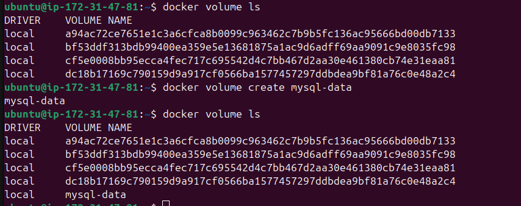
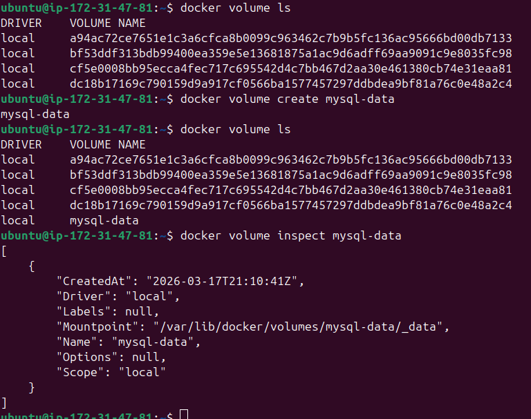

---

### Persisting MySQL Data with Named Volume

**Run a MySQL container with a named volume:**

```bash
docker run -d \
  -e MYSQL_ROOT_PASSWORD=root \
  -v mysql-data:/var/lib/mysql \
  mysql:latest
```

> `-v mysql-data:/var/lib/mysql` mounts the named volume `mysql-data` to MySQL's internal data directory, so data survives container restarts or deletion.

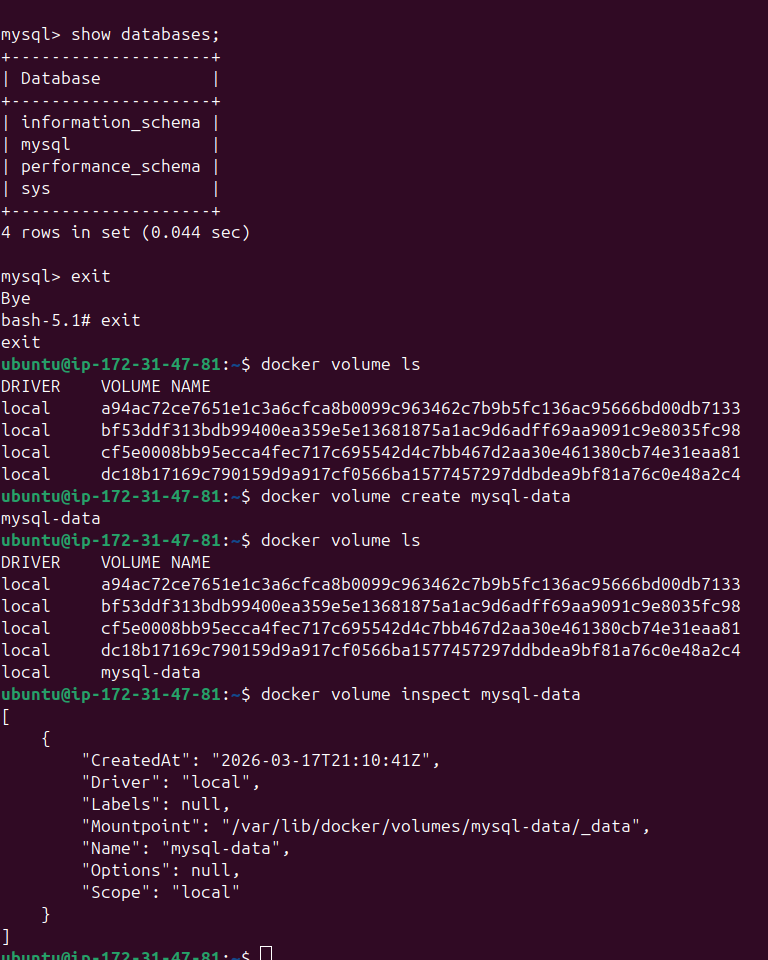

**Verify the container is up:**

```bash
docker ps
```

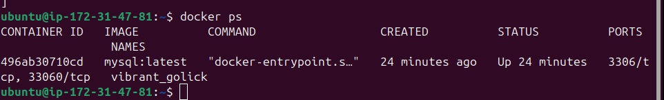

---

### Creating Database and Table Inside Container

```bash
docker exec -it <container_id> bash
mysql -u root -p
```

```sql
CREATE DATABASE kyc;
USE kyc;
CREATE TABLE aadhar (id INT AUTO_INCREMENT PRIMARY KEY, messege TEXT);
INSERT INTO aadhar (messege) VALUES ("abhinay ki KYC updated");
SELECT * FROM aadhar;
```

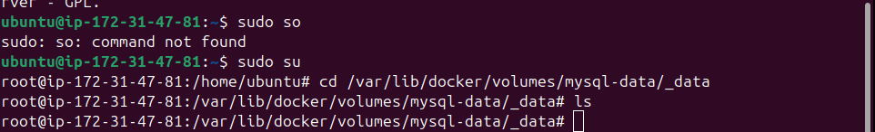
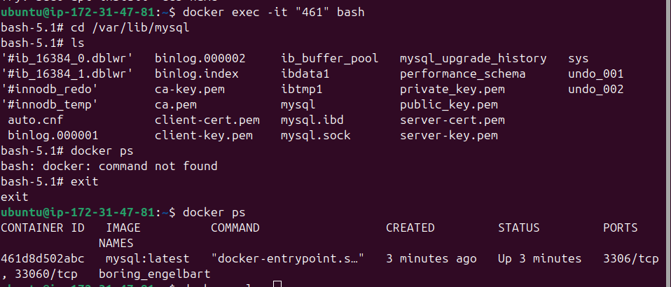

---

### Inspecting Volume Data on Host

Navigating to the volume's mountpoint on the host to confirm data is persisted:

```bash
sudo su
cd /var/lib/docker/volumes/mysql-data/_data
ls
```

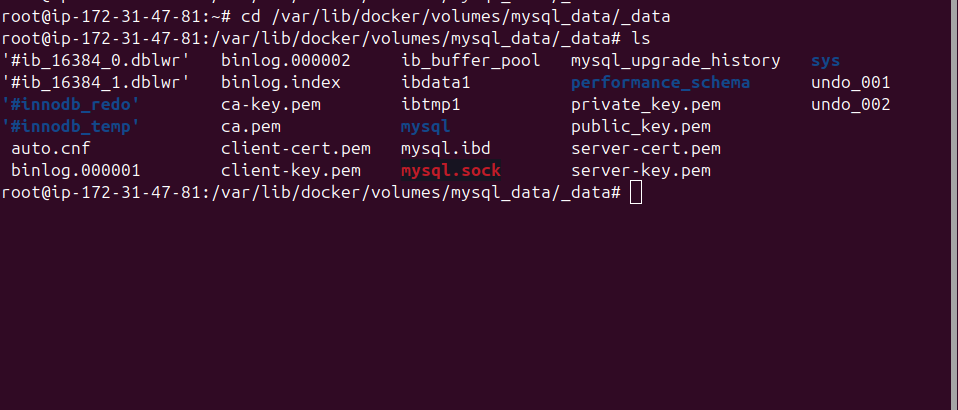
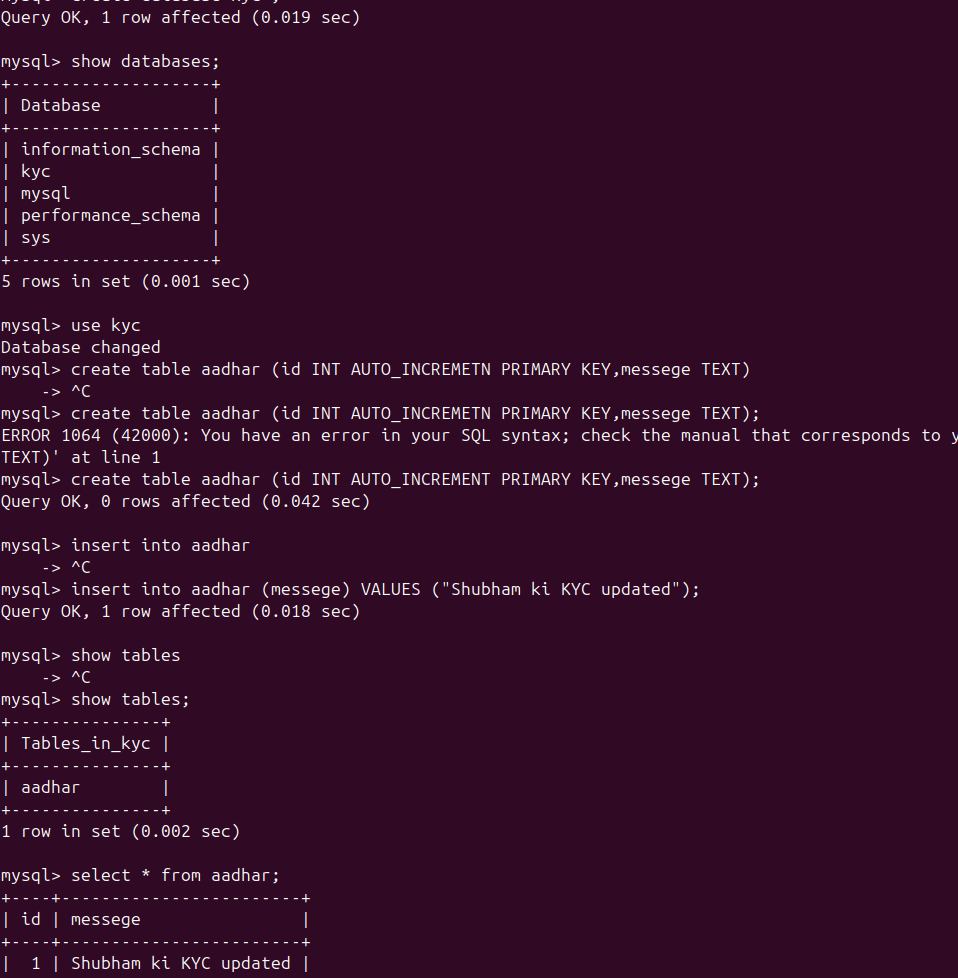

---

### Data Persistence Test — Stop, Remove, Recreate Container

```bash
# Stop and remove the old container
docker stop <id> && docker rm <id>

# Run a NEW container mounting the SAME volume
docker run -d \
  -e MYSQL_ROOT_PASSWORD=root \
  -v mysql_data:/var/lib/mysql \
  mysql:latest

docker exec -it dec bash
mysql -u root -p
```

```sql
SHOW DATABASES;
USE kyc;
SHOW TABLES;
SELECT * FROM aadhar;
```

The `kyc` database and `aadhar` table are still present — **data persisted across containers!** ✅

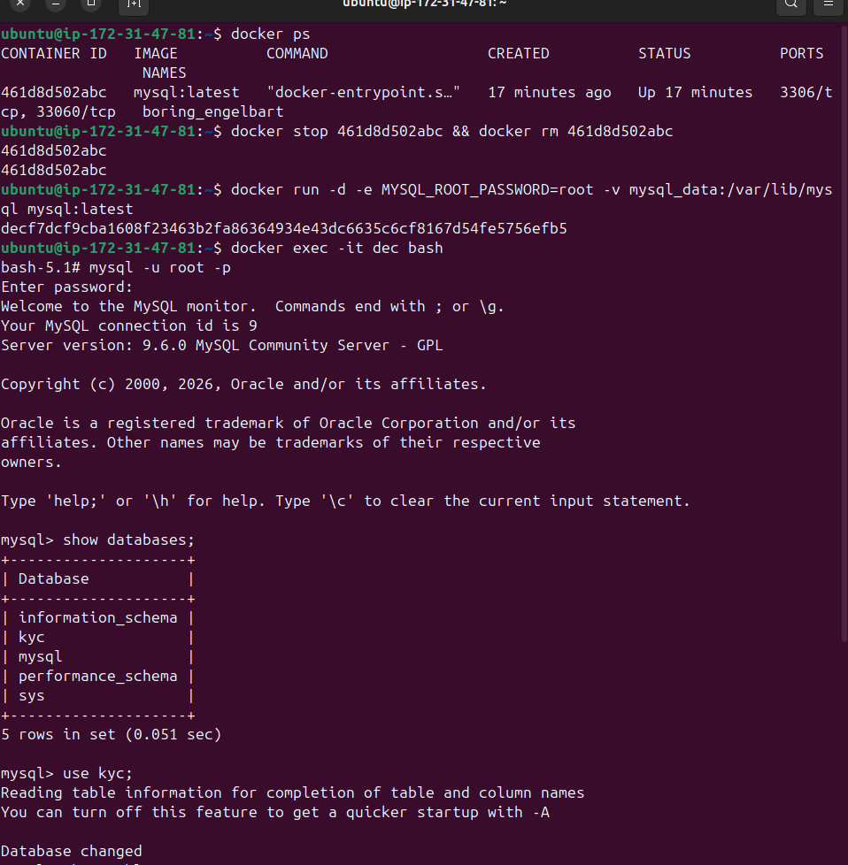
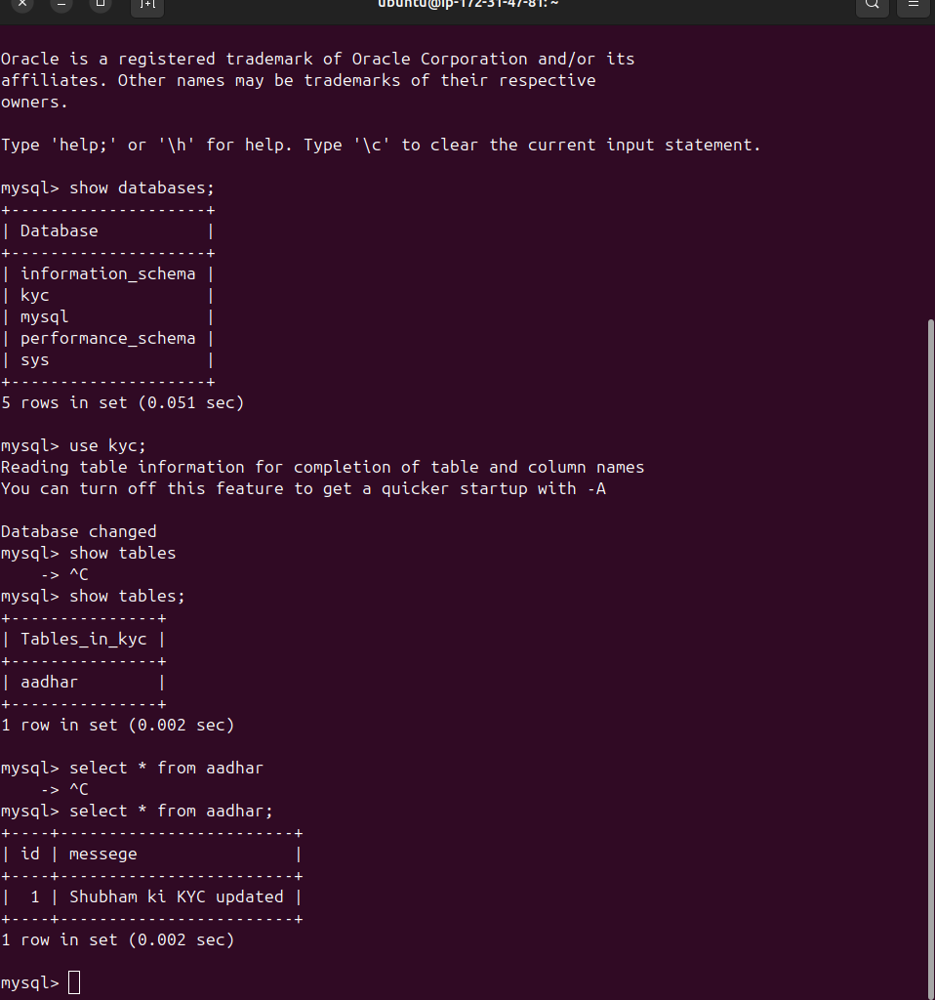

---

## 🌐 Docker Networking

### Creating a Custom Network

```bash
docker network create my-custom-network
docker network ls
```

Docker creates a **bridge** network by default. Custom networks provide automatic DNS resolution between containers — containers can reach each other by **name**, not just IP.

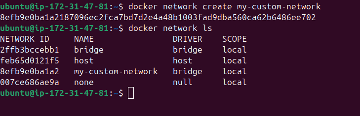

---

### Running Containers on Custom Network

```bash
docker run -dit --name cont1 --network my-custom-network alpine sh
docker run -dit --name cont2 --network my-custom-network alpine sh
docker run -dit --name cont3 --network my-custom-network alpine sh
docker ps
```

> ⚠️ Note: Alpine does not have `bash`. Use `sh` instead of `bash` — using `bash` will throw an error.

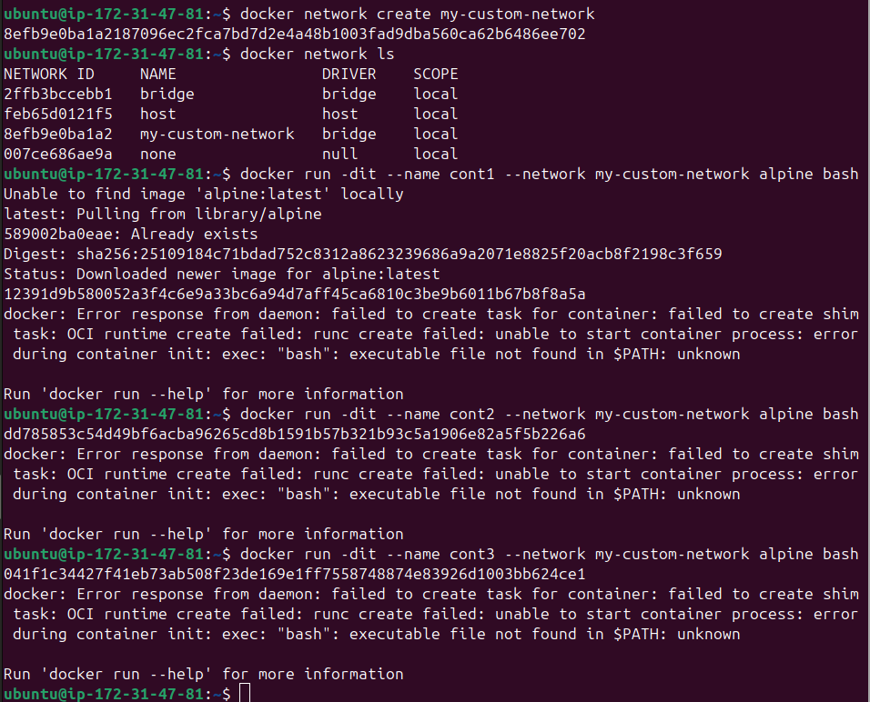
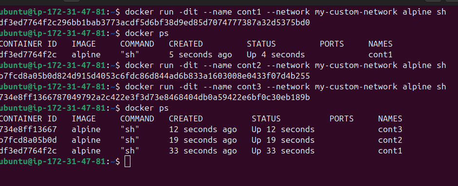

---

### Inspecting the Network

```bash
docker network inspect my-custom-network
```

Shows subnet `172.18.0.0/16`, gateway `172.18.0.1`, and all three connected containers with their assigned IPs:

| Container | IP Address   |
|-----------|-------------|
| cont1     | 172.18.0.2  |
| cont2     | 172.18.0.3  |
| cont3     | 172.18.0.4  |

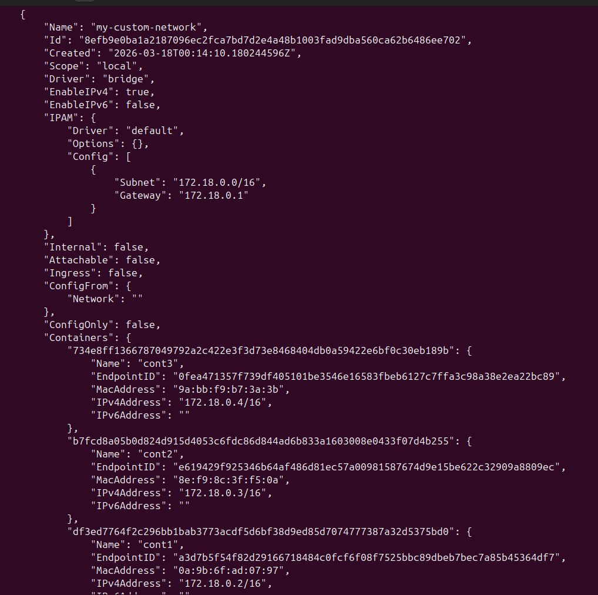

---

### Container-to-Container Connectivity

**Inside `cont1` — checking its own IP and pinging by name:**

```bash
docker exec -it cont1 sh
ip addr show eth0
ping -c 4 cont2
ping -c 4 cont3
```

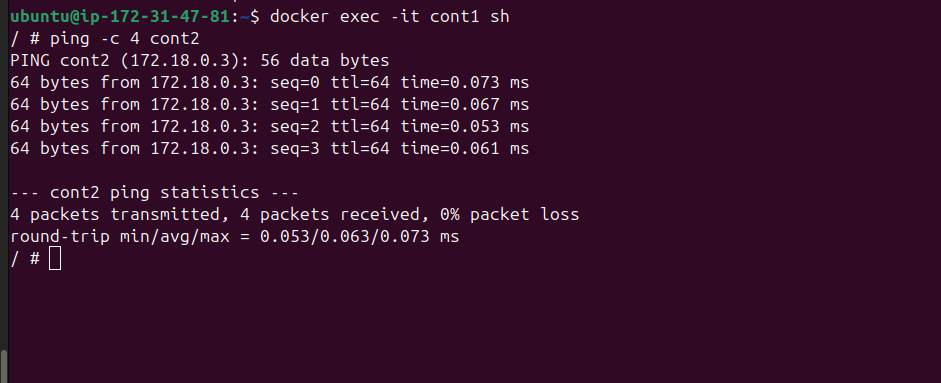
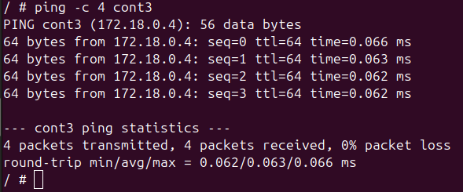
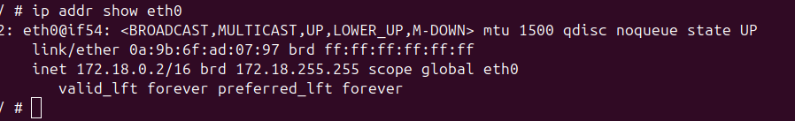

**Inside `cont3` — pinging cont1 and cont2 by name:**

```bash
docker exec -it cont3 sh
ping -c 2 cont1
ping -c 2 cont2
```

All pings resolve by container name with **0% packet loss** — Docker's embedded DNS is doing the resolution. 🎯

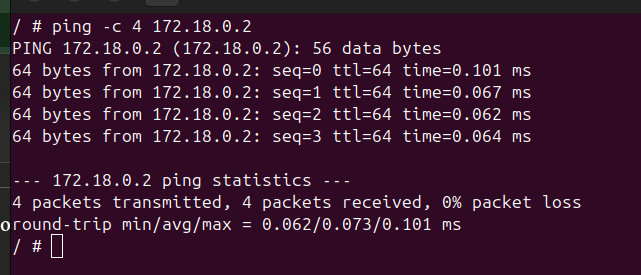

**Also verified by IP directly:**

```bash
ping -c 4 172.18.0.2
```

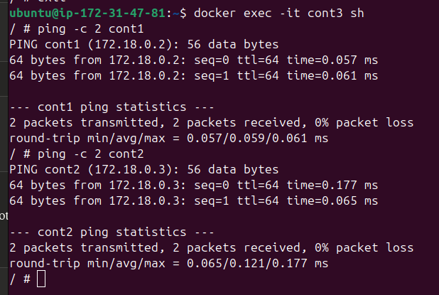

---

## 🧠 Key Concepts Summary

| Concept | What it does |
|--------|--------------|
| `docker volume create` | Creates a named volume managed by Docker |
| `-v volume_name:/path` | Mounts volume into container at given path |
| `docker volume inspect` | Shows host mountpoint and metadata |
| `docker network create` | Creates a custom bridge network |
| `--network <name>` | Attaches container to specified network |
| DNS by container name | On custom networks, containers resolve each other by name automatically |
| Data persistence | Named volumes outlive containers — data survives `stop`, `rm`, recreate |

---

> 💡 **Tip:** Always use named volumes (not anonymous volumes) for databases so you can reattach them to new containers easily.