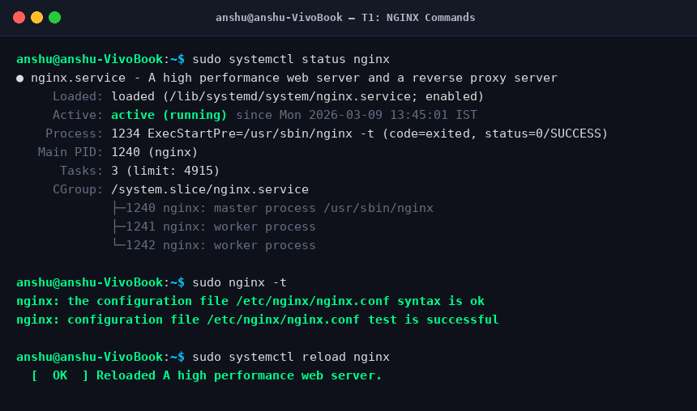
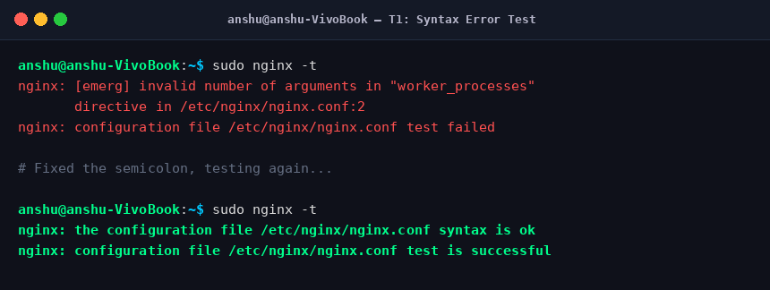
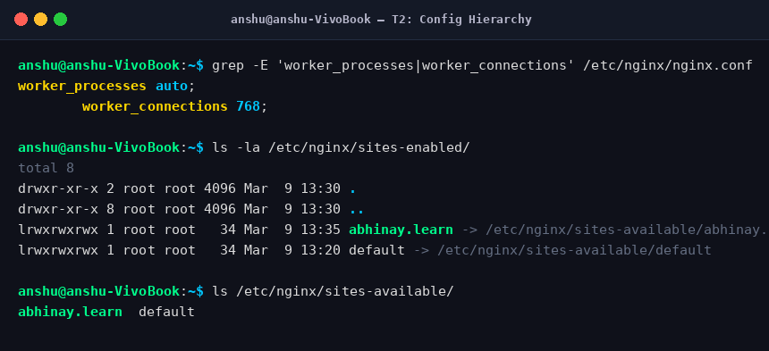
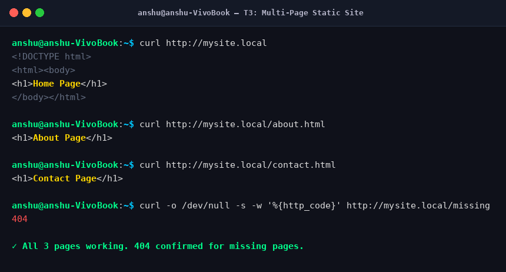
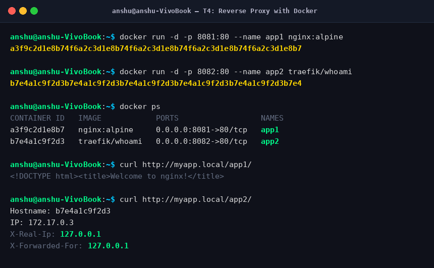
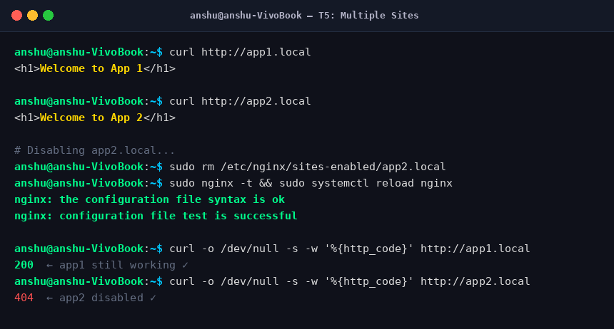
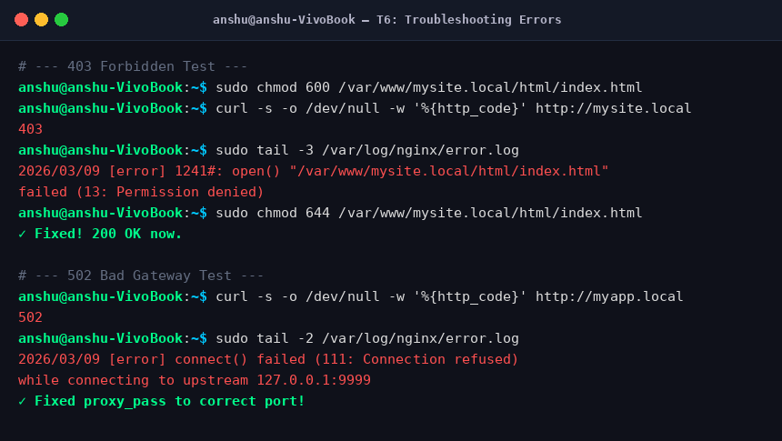

# 🟢 NGINX Web Server — Day 3 Tasks

**Name:** Abhinay  
**Date:** 09 March 2026  
**Topic:** NGINX — Web Server, Reverse Proxy, Load Balancer  

---

## Task Overview

| Task | Title | Status |
|------|-------|--------|
| T1 | Test All NGINX Management Commands | ✅ Done |
| T2 | Explore the NGINX Config Hierarchy | ✅ Done |
| T3 | Host a Multi-Page Static Site | ✅ Done |
| T4 | Reverse Proxy Two Docker Containers | ✅ Done |
| T5 | Host app1.local and app2.local | ✅ Done |
| T6 | Diagnose and Fix 3 Common Errors | ✅ Done |

---

## T1 — Test All NGINX Management Commands

**What I did:**
- Ran all systemctl commands: `start`, `stop`, `restart`, `reload`, `enable`
- Intentionally introduced a syntax error in `nginx.conf` (removed semicolon)
- Confirmed `nginx -t` caught the error before any reload
- Fixed the error and retested

**Commands used:**
```bash
sudo systemctl start nginx
sudo systemctl stop nginx
sudo systemctl restart nginx
sudo systemctl reload nginx
sudo systemctl enable nginx
sudo systemctl status nginx
sudo nginx -t
```

**Output — Service Status & Reload:**



**Output — Syntax Error Test:**



**Key Learning:**  
Always run `sudo nginx -t` before reloading. It validates the config without applying it — so a broken config never crashes the live server.

---

## T2 — Explore the NGINX Config Hierarchy

**What I did:**
- Opened `/etc/nginx/nginx.conf` and identified `main`, `events`, and `http` contexts
- Noted `worker_processes auto` and `worker_connections 768`
- Listed all files in `sites-available` and `sites-enabled`
- Verified symlinks with `ls -la`

**Commands used:**
```bash
cat /etc/nginx/nginx.conf
grep -E 'worker_processes|worker_connections' /etc/nginx/nginx.conf
ls /etc/nginx/sites-available/
ls -la /etc/nginx/sites-enabled/
```

**Output:**



**Config Structure understood:**
```
main context        → worker_processes, error_log, pid
events {}           → worker_connections
http {}             → gzip, access_log
  server {}         → listen, server_name, root
    location {}     → try_files, proxy_pass
```

**Key Learning:**  
`sites-enabled/` only contains symlinks pointing to `sites-available/`. Deleting a symlink disables a site without deleting the config file.

---

## T3 — Host a Multi-Page Static Site

**What I did:**
- Created `/var/www/mysite.local` with 3 pages: `index.html`, `about.html`, `contact.html`
- Wrote a server block config in `sites-available/mysite.local`
- Added `mysite.local` to `/etc/hosts`
- Verified all 3 pages load and confirmed 404 for missing pages

**Commands used:**
```bash
sudo mkdir -p /var/www/mysite.local/html
echo '<h1>Home Page</h1>'    | sudo tee /var/www/mysite.local/html/index.html
echo '<h1>About Page</h1>'   | sudo tee /var/www/mysite.local/html/about.html
echo '<h1>Contact Page</h1>' | sudo tee /var/www/mysite.local/html/contact.html

sudo ln -s /etc/nginx/sites-available/mysite.local /etc/nginx/sites-enabled/
sudo nginx -t && sudo systemctl reload nginx

sudo sh -c 'echo "127.0.0.1 mysite.local" >> /etc/hosts'

curl http://mysite.local
curl http://mysite.local/about.html
curl http://mysite.local/contact.html
curl -o /dev/null -s -w '%{http_code}' http://mysite.local/missing
```

**Server Block Config:**
```nginx
server {
    listen 80;
    server_name mysite.local;

    root /var/www/mysite.local/html;
    index index.html;

    location / {
        try_files $uri $uri/ =404;
    }
}
```

**Output:**



**Key Learning:**  
`try_files $uri $uri/ =404` — first tries exact file match, then directory, then returns 404. This is the standard pattern for all static sites.

---

## T4 — Reverse Proxy Two Docker Containers

**What I did:**
- Started `nginx:alpine` container on port 8081
- Started `traefik/whoami` container on port 8082
- Configured Nginx with two `location` blocks to proxy each path
- Verified `X-Real-IP` header is passed correctly

**Commands used:**
```bash
docker run -d -p 8081:80 --name app1 nginx:alpine
docker run -d -p 8082:80 --name app2 traefik/whoami
docker ps

curl http://myapp.local/app1/
curl http://myapp.local/app2/
```

**Nginx Config:**
```nginx
server {
    listen 80;
    server_name myapp.local;

    location /app1/ {
        proxy_pass http://127.0.0.1:8081/;
        proxy_set_header Host $host;
        proxy_set_header X-Real-IP $remote_addr;
        proxy_set_header X-Forwarded-For $proxy_add_x_forwarded_for;
    }

    location /app2/ {
        proxy_pass http://127.0.0.1:8082/;
        proxy_set_header Host $host;
        proxy_set_header X-Real-IP $remote_addr;
        proxy_set_header X-Forwarded-For $proxy_add_x_forwarded_for;
    }
}
```

**Output:**



**Key Learning:**  
`proxy_pass` forwards requests to a backend. `proxy_set_header X-Real-IP` passes the real client IP to the backend app — otherwise the app would only see Nginx's IP.

---

## T5 — Host app1.local and app2.local

**What I did:**
- Created separate web roots and configs for `app1.local` and `app2.local`
- Added both to `/etc/hosts`
- Disabled `app2.local` by removing symlink and confirmed only `app1.local` works
- Re-enabled `app2.local` and reloaded

**Commands used:**
```bash
sudo mkdir -p /var/www/app1.local/html /var/www/app2.local/html
echo '<h1>Welcome to App 1</h1>' > /var/www/app1.local/html/index.html
echo '<h1>Welcome to App 2</h1>' > /var/www/app2.local/html/index.html

sudo ln -s /etc/nginx/sites-available/app1.local /etc/nginx/sites-enabled/
sudo ln -s /etc/nginx/sites-available/app2.local /etc/nginx/sites-enabled/
sudo nginx -t && sudo systemctl reload nginx

# Disable app2
sudo rm /etc/nginx/sites-enabled/app2.local
sudo nginx -t && sudo systemctl reload nginx

# Re-enable app2
sudo ln -s /etc/nginx/sites-available/app2.local /etc/nginx/sites-enabled/
sudo systemctl reload nginx
```

**Output:**



**Key Learning:**  
Disabling a site = just delete the symlink from `sites-enabled/`. The actual config file stays safe in `sites-available/`. This is why the two-folder pattern exists.

---

## T6 — Diagnose and Fix 3 Common Errors

**What I did:**
- Caused and fixed **403 Forbidden** by setting wrong file permissions
- Caused and fixed **502 Bad Gateway** by pointing `proxy_pass` to a dead port
- Caused and fixed a **config syntax error** by removing a closing brace

**Error 1 — 403 Forbidden:**
```bash
sudo chmod 600 /var/www/mysite.local/html/index.html   # cause it
curl -s -o /dev/null -w '%{http_code}' http://mysite.local
# → 403

sudo tail -5 /var/log/nginx/error.log
# → open() failed (13: Permission denied)

sudo chmod 644 /var/www/mysite.local/html/index.html   # fix it
```

**Error 2 — 502 Bad Gateway:**
```bash
# Change proxy_pass to a dead port in config
proxy_pass http://127.0.0.1:9999;
sudo systemctl reload nginx

curl -s -o /dev/null -w '%{http_code}' http://myapp.local
# → 502

sudo tail -5 /var/log/nginx/error.log
# → connect() failed (111: Connection refused)

# Fix: restore correct port in proxy_pass
```

**Error 3 — Config Syntax Error:**
```bash
# Remove a closing brace from server block
sudo nginx -t
# → [emerg] unexpected end of file

# Fix: add the closing brace back
sudo nginx -t   # → syntax is ok
```

**Output:**



**Error Reference Table:**

| Error | Cause | Log File | Fix |
|-------|-------|----------|-----|
| 403 Forbidden | Wrong file permissions | `error.log` | `chmod 644`, `chown www-data` |
| 404 Not Found | Wrong root path or missing file | `error.log` | Check `root` directive |
| 502 Bad Gateway | Backend app/container is down | `error.log` | Check `docker ps`, fix `proxy_pass` port |
| Config fails | Syntax error in config | `nginx -t` output | Fix syntax, re-run `nginx -t` |

**Key Learning:**  
Always check `/var/log/nginx/error.log` first when something breaks. The error message tells you exactly what went wrong and on which line.

---

## Summary

```
Browser → NGINX (:80) → Static files  (/var/www/)
                      → Docker app    (proxy_pass :8081)
                      → Another app   (proxy_pass :8082)
```

- `nginx -t` before every reload — always
- `systemctl reload` not restart — zero downtime
- `sites-enabled/` = symlinks only — easy enable/disable
- `error.log` = first place to check when anything breaks

---

*NGINX Day 3 — DevOps Learning Track*
