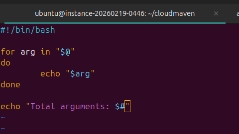
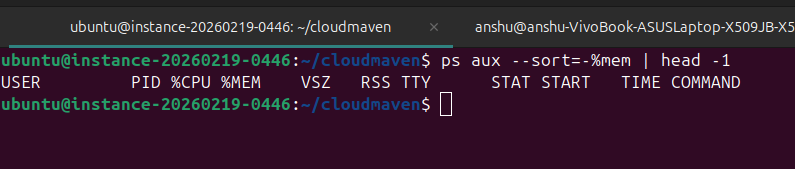
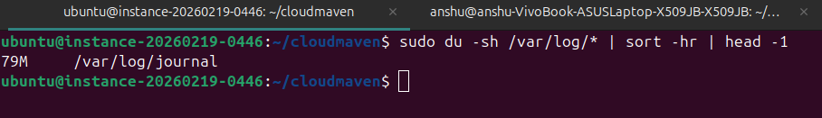
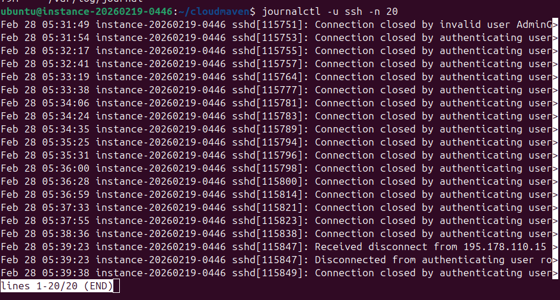
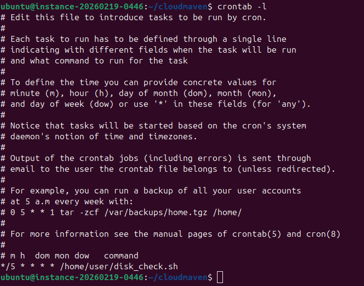

# 🖥️ Linux System Administration — Homework / Deliverables

A set of practical Linux tasks covering shell scripting, process monitoring, log analysis, and job scheduling.

---

## 1️⃣ `countargs.sh` — Count & Print Arguments

A Bash script that loops through all passed arguments, prints each one, and displays the total count.



```bash
#!/bin/bash

for arg in "$@"
do
        echo "$arg"
done

echo "Total arguments: $#"
```

**Usage:**
```bash
bash countargs.sh apple banana cherry
# Output:
# apple
# banana
# cherry
# Total arguments: 3
```

---

## 2️⃣ Which Process Uses the Most Memory?

Use `ps` with sort by memory to find the top memory-consuming process.



```bash
ps aux --sort=-%mem | head -1
```

> Returns the process using the most RAM on the system.

---

## 3️⃣ Largest Directory in `/var/log`

Use `du` to find which subdirectory under `/var/log` takes up the most disk space.



```bash
sudo du -sh /var/log/* | sort -hr | head -1
```

**Sample Output:**
```
79M    /var/log/journal
```

---

## 4️⃣ Last 20 SSH Logs

View the last 20 SSH service log entries using `journalctl`.



```bash
journalctl -u ssh -n 20
```

> Shows recent SSH connection attempts, including failed/closed connections. Useful for detecting unauthorized access or brute-force attempts.

---

## 5️⃣ Schedule a Script via Cron

Schedule `/home/user/disk_check.sh` to run every 5 minutes using `cron`.



**Edit the crontab:**
```bash
crontab -e
```

**Add this line:**
```cron
*/5 * * * * /home/user/disk_check.sh
```

**Verify:**
```bash
crontab -l
```

> The `*/5` expression means the script runs at minute 0, 5, 10, 15... of every hour, every day.

---

## 📋 Summary Table

| # | Task | Command |
|---|------|---------|
| 1 | Count arguments in a script | `bash countargs.sh [args...]` |
| 2 | Top memory process | `ps aux --sort=-%mem \| head -1` |
| 3 | Largest dir in /var/log | `sudo du -sh /var/log/* \| sort -hr \| head -1` |
| 4 | Last 20 SSH logs | `journalctl -u ssh -n 20` |
| 5 | Schedule script via cron | `*/5 * * * * /home/user/disk_check.sh` |

---

## 🛠️ Prerequisites

- Ubuntu / Debian Linux
- `bash`, `ps`, `du`, `journalctl`, `crontab` — all available by default
- `sudo` privileges for reading `/var/log`
