# Networking Lab Tasks

> **Setup:** All screenshots are stored in the `images/` folder of this repository. Make sure to upload all screenshots into an `images/` directory alongside this README for the images to display correctly on GitHub.

---

## Task 1 — Check Your IP Address

View all network interfaces and assigned IP addresses:

```bash
ip addr
```

**Output:**

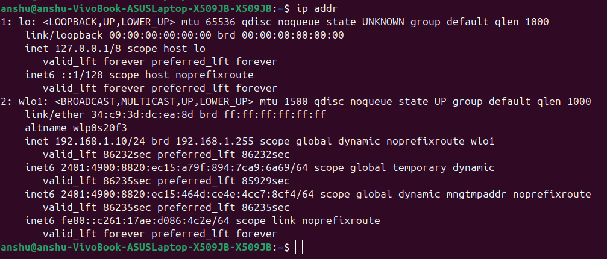

---

## Task 2 — View Routing Table & Hostname

Check the default gateway and routing information:

```bash
ip route
hostname -I
```

**Routing Table:**

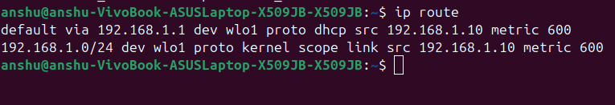

**Hostname IP:**

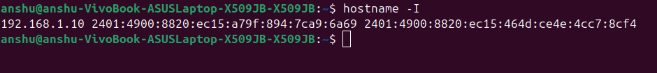

---

## Task 3 — Analyze DNS in Detail

Investigate how domain names resolve:

```bash
dig google.com
nslookup google.com
```

Check:
- Returned IP addresses
- DNS server used
- Response time

Try resolving a non-existent domain to observe failure behavior.

**dig Output:**

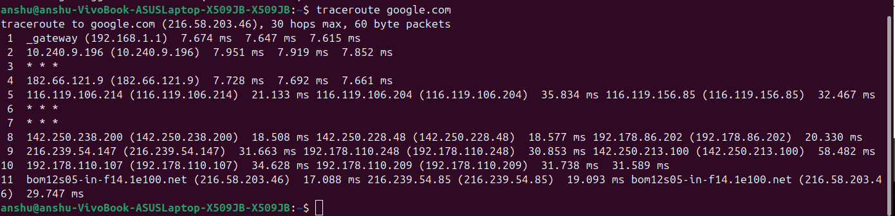

**nslookup Output:**

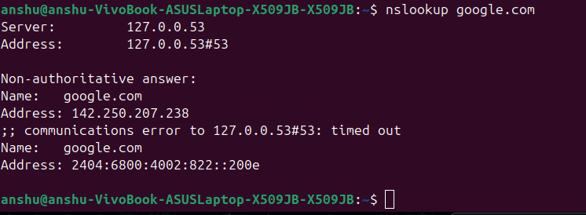

---

## Task 4 — Host a Simple Website Locally

Install a web server (Nginx):

```bash
sudo apt install nginx
```

Create a simple page:

```bash
echo "Hello from my server" | sudo tee /var/www/html/index.html
```

Test locally:

```bash
curl http://localhost
```

Find your system IP:

```bash
ip addr
```

Access from browser using: `http://your_ip`

This demonstrates how HTTP traffic reaches your system.

**Ping Tests (connectivity verification):**

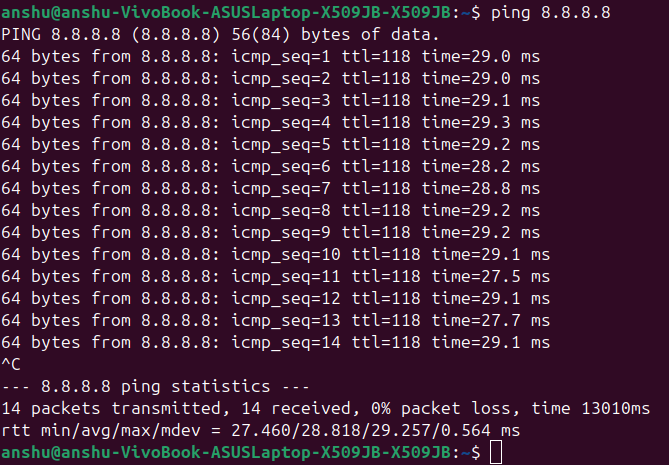

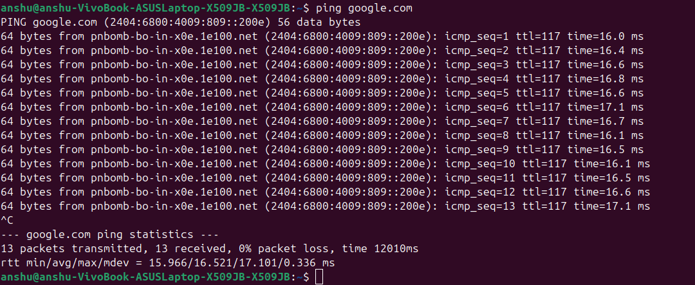

---

## Task 5 — Check Listening Ports

Verify that your web server is actually listening:

```bash
ss -tuln
```

Identify port **80** (HTTP).

**Output:**

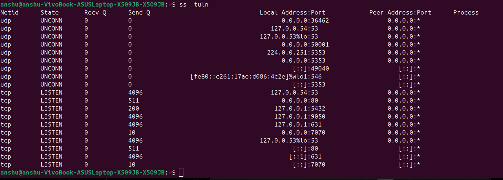

Try stopping the server:

```bash
sudo systemctl stop nginx
```

Check again — the port should disappear.

---

## Task 6 — Test Application Connectivity

Fetch HTTP headers:

```bash
curl -I http://localhost
```

Observe status code and server response.

Download content:

```bash
wget http://localhost
```

**curl Output:**

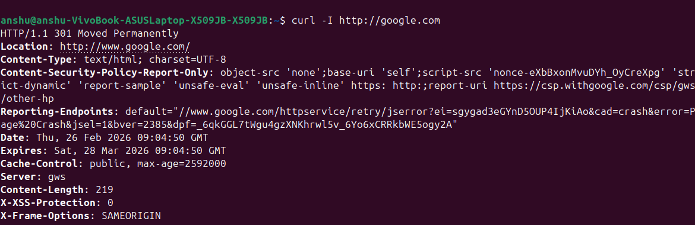

---

## Task 7 — Simulate a Firewall Restriction (UFW)

Enable firewall:

```bash
sudo ufw enable
```

Allow only web traffic:

```bash
sudo ufw allow 80
sudo ufw allow 443
```

Block SSH temporarily *(be careful on remote machines)*:

```bash
sudo ufw deny 22
```

Check status:

```bash
sudo ufw status
```

Test connectivity again.

---

## Task 8 — Create a Local Domain Using /etc/hosts

Edit the hosts file:

```bash
sudo nano /etc/hosts
```

Add the following line:

```
127.0.2.1 abhinay.local
```

Now access: `http://abhinay.local`

This demonstrates local DNS resolution.

**hosts file:**

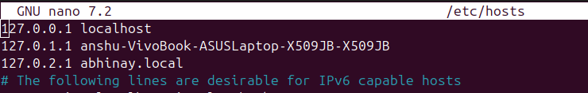

**Browser result:**

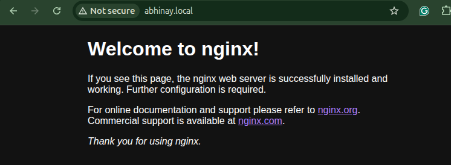

---

## Additional: Traceroute

Trace the network path to a destination:

```bash
traceroute google.com
```

**Output:**

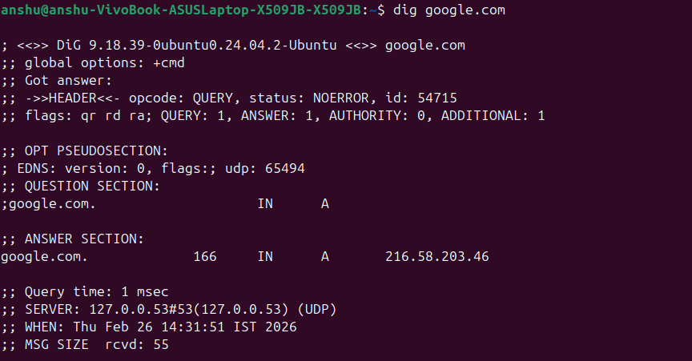

---

## Additional: /etc/services — Common Port Reference

View well-known ports and protocols:

```bash
cat /etc/services | grep ssh
cat /etc/services | grep mail
cat /etc/services | grep https
cat /etc/services | grep 80
```

**Output:**

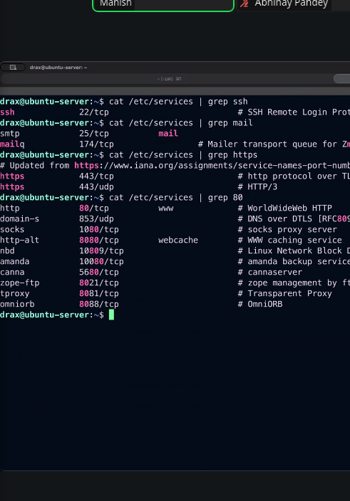

---

## How to Use This Repository

1. Clone or download this repo.
2. Make sure all screenshots are placed inside an `images/` folder at the root of the repository.
3. The image filenames must match exactly as referenced above.
4. Push everything to GitHub — all images will render automatically in this README.

### Folder Structure

```
your-repo/
├── README.md
└── images/
    ├── Screenshot_from_2026-02-25_16-51-19.png
    ├── Screenshot_from_2026-02-26_14-27-24.png
    ├── Screenshot_from_2026-02-26_14-27-53.png
    ├── Screenshot_from_2026-02-26_14-28-13.png
    ├── Screenshot_from_2026-02-26_14-29-11.png
    ├── Screenshot_from_2026-02-26_14-29-58.png
    ├── Screenshot_from_2026-02-26_14-31-40.png
    ├── Screenshot_from_2026-02-26_14-32-02.png
    ├── Screenshot_from_2026-02-26_14-34-00.png
    ├── Screenshot_from_2026-02-26_14-35-11.png
    ├── Screenshot_from_2026-02-26_14-36-34.png
    ├── Screenshot_from_2026-02-26_14-36-56.png
    ├── Screenshot_from_2026-02-26_14-38-08.png
    ├── Screenshot_from_2026-02-26_14-42-11.png
    ├── Screenshot_from_2026-02-26_14-42-28.png
    └── Screenshot_from_2026-02-26_14-42-34.png
```
