# Linux Administration Test – My Solutions

These are my practical solutions to the Linux admin test, done on an Ubuntu 24 VM (`ubuntu@ip-172-31-36-107`) on Feb 27, 2026. Each section maps to the questions in the test PDF.

---

## 1. Permissions & umask

### 1a. Create `test.txt` with default permissions

Pretty straightforward — just `touch` the file and check what permissions it got:

```bash
touch test.txt
ls -l test.txt
# -rw-r--r-- 1 ubuntu ubuntu 0 Feb 27 06:17 test.txt
```

### 1b. Show `umask` output and explain how it affected the file

```bash
umask 666
touch test_new.txt
ls -l test_new.txt
# ---------- 1 ubuntu ubuntu 0 Feb 27 06:18 test_new.txt
```

The `umask` works like a permission filter — it removes bits from the default. For files, Linux starts with a base of `666` (read+write for everyone, no execute). With the default `umask 022`, you get `666 - 022 = 644`, which is `-rw-r--r--`. When I set `umask 666`, it stripped all permissions: `666 - 666 = 000`, giving `----------`.

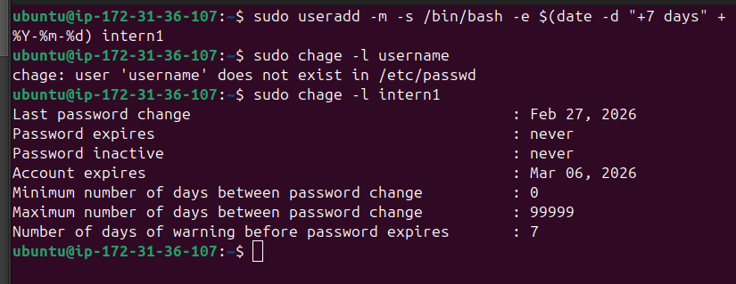


---

## 2. Users

### 2a. Create `intern1` with `/bin/bash` shell, expiring in 7 days

```bash
sudo useradd -m -s /bin/bash -e $(date -d "+7 days" +%Y-%m-%d) intern1
sudo chage -l intern1
```

The `-e` flag sets the account expiry. I used `$(date -d "+7 days")` so it calculated the date automatically instead of hardcoding it. Verified with `chage -l`:

```
Last password change   : Feb 27, 2026
Account expires        : Mar 06, 2026
```


---

## 3. SSH

### 3a. Generate SSH keypair and add to `authorized_keys`

```bash
ssh-keygen
# generates id_ed25519 and id_ed25519.pub in ~/.ssh/

cd ~/.ssh && ls
# authorized_keys  id_ed25519  id_ed25519.pub
```

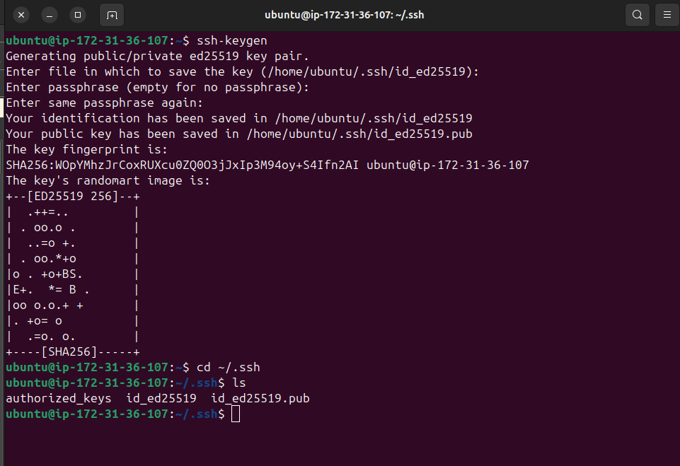

After generating the keypair, I added the public key to `authorized_keys` so the same machine can log in to itself without a password:

```bash
cat id_ed25519.pub >> ~/.ssh/authorized_keys
ssh -i ~/.ssh/id_ed25519 localhost
```


---

## 4. Package Management

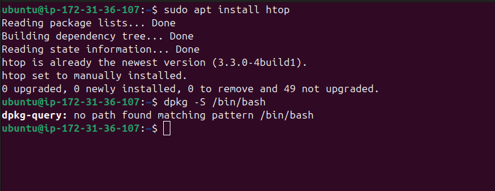

### 4a. Install `htop` and find which package provides `/bin/bash`

```bash
sudo apt install htop
# htop is already the newest version (3.3.0-4build1).

dpkg -S /bin/bash
# dpkg-query: no path found matching pattern /bin/bash
```

`htop` was already installed. For `/bin/bash`, `dpkg -S` returned nothing because `/bin/bash` is actually a symlink on this system. The correct way is:

```bash
dpkg -S $(readlink -f /bin/bash)
# bash: /usr/bin/bash
```

That shows it's provided by the `bash` package.


---

## 5. Cron

### 5a. Run `/usr/bin/date` every minute, append to log, show `crontab -l`

Opened the crontab editor and added the job:

```bash
crontab -e
```

```
#*/5 * * * * echo "$(date) - Test" >> /tmp/test.log
*/2 * * * * /usr/bin/date >> /tmp/date_output.log 2>&1
```

Verified it was saved:

```bash
crontab -l
```

Then waited a few minutes and checked the output file:

```bash
cat /tmp/date_output.log
```

```
Fri Feb 27 07:31:01 UTC 2026
Fri Feb 27 07:32:01 UTC 2026
Fri Feb 27 07:33:01 UTC 2026
Fri Feb 27 07:34:01 UTC 2026
Fri Feb 27 07:35:01 UTC 2026
```

It's working — the date gets appended every minute.

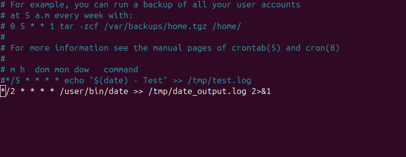
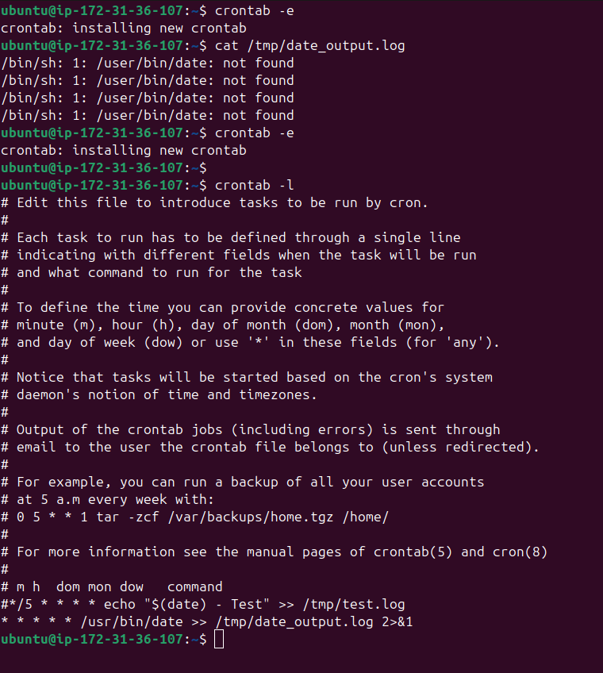

---

## 6. Systemd Timer

### 6a. Write a service + timer that echoes "Hello from systemd" every 2 minutes

First I created the service unit at `/etc/systemd/system/hello.service`:

```ini
[Unit]
Description=Hello from systemd service

[Service]
Type=oneshot
ExecStart=/bin/bash -c 'echo "Hello from systemd" >> /tmp/hello.txt'
```

Then the timer at `/etc/systemd/system/hello.timer`:

```ini
[Unit]
Description=Run hello.service every 2 minutes

[Timer]
OnBootSec=1min
OnUnitActiveSec=2min
Unit=hello.service

[Install]
WantedBy=timers.target
```

Then enabled and started it:

```bash
sudo systemctl daemon-reload
sudo systemctl enable hello.timer
# Created symlink /etc/systemd/system/timers.target.wants/hello.timer → /etc/systemd/system/hello.timer
sudo systemctl start hello.timer
systemctl list-timers
```

You can see `hello.timer` showing up in the timer list with its next scheduled run.


---
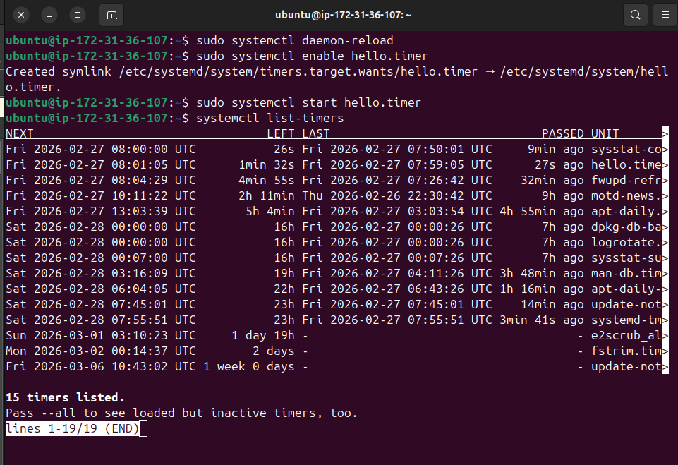

## 7. Network

### 7a. Ping Google DNS

```bash
ping 8.8.8.8
```

```
9 packets transmitted, 9 received, 0% packet loss, time 8012ms
rtt min/avg/max/mdev = 3.283/3.310/3.355/0.022 ms
```

Clean result — no packet loss, consistent latency around 3.3ms.


### 7b. Show processes listening on TCP ports, check if port 80 is open

```bash
ss -tlnp | grep :80
```

```
LISTEN  0  511  0.0.0.0:80  0.0.0.0:*
LISTEN  0  511     [::]:80     [::]:*
```

Port 80 is open and listening on both IPv4 and IPv6.

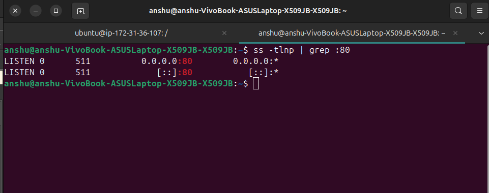

### 7c. tcpdump capture for HTTP, save to `/tmp/http.pcap`

```bash
sudo tcpdump -i any port 80 -w http.pcap
```

```
1 packet received by filter
0 packets dropped by kernel
```

```bash
ls -lh http.pcap
# -rw-r--r-- 1 tcpdump tcpdump 24 Feb 27 07:43 http.pcap
```


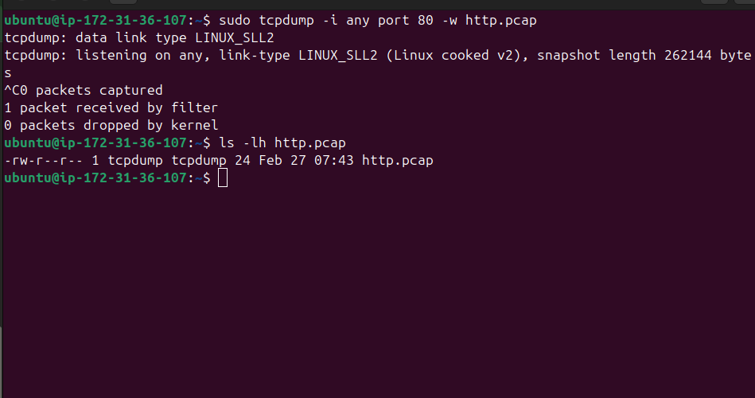

### 7d. `curl -I` response headers and `dig +short` A record

```bash
curl -I google.com
```

```
HTTP/1.1 301 Moved Permanently
Location: http://www.google.com/
Server: gws
Content-Type: text/html; charset=UTF-8
```

```bash
dig +short google.com
# 142.250.77.46
```
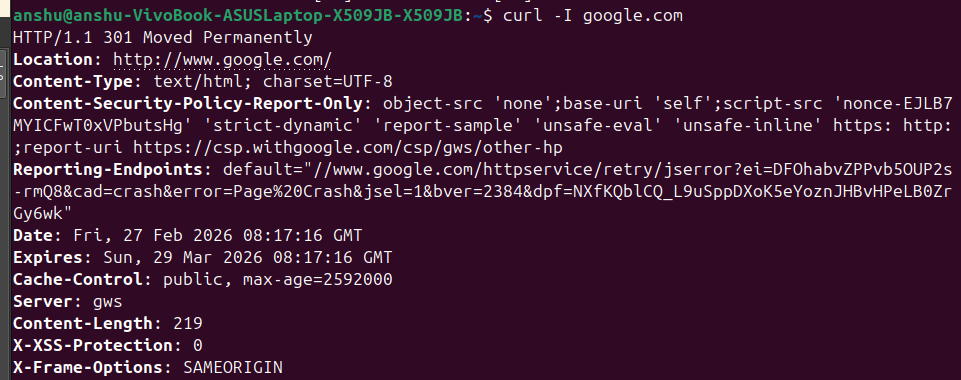

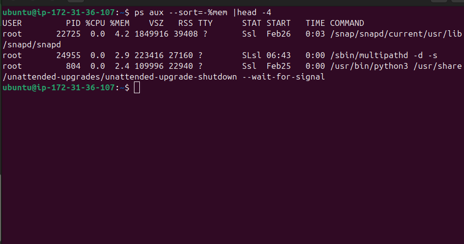


---

## 8. Monitoring

### 8a. Check disk usage with `df -h` and `du -sh /var/log`

```bash
df -h
sudo du -sh /var/log
# 19M  /var/log
```

| Filesystem      | Size  | Used | Avail | Use% | Mounted on |
|----------------|-------|------|-------|------|------------|
| /dev/root       | 8.7G  | 2.4G | 6.3G  | 28%  | /          |
| /dev/nvme0n1p16 | 881M  | 156M | 663M  | 20%  | /boot      |

Root filesystem is at 28% — plenty of space. Logs are using 19MB.

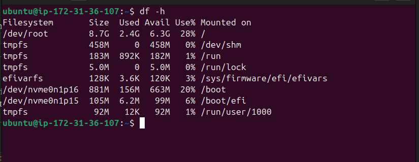

### 8b. Top 3 processes by memory usage

```bash
ps aux --sort=-%mem | head -4
```

```
USER   PID    %CPU  %MEM   VSZ      RSS    COMMAND
root   22725   0.0   4.2  1849916  39408  /snap/snapd/current/usr/lib/snapd/snapd
root   24955   0.0   2.9   223416  27160  /sbin/multipathd -d -s
root     804   0.0   2.4   109996  22940  /usr/bin/python3 ...unattended-upgrades
```

I used `--sort=-%mem` to sort by memory descending, then `head -4` (4 lines = 1 header + 3 processes). `snapd` is the top consumer at 4.2%.

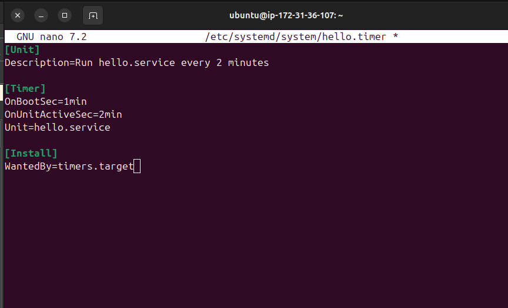

### 8c. Last 20 lines of the systemd journal and `/var/log/syslog`

```bash
journalctl -n 20
tail -n 20 /var/log/syslog
```

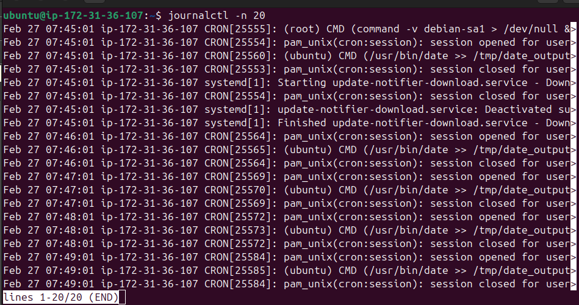
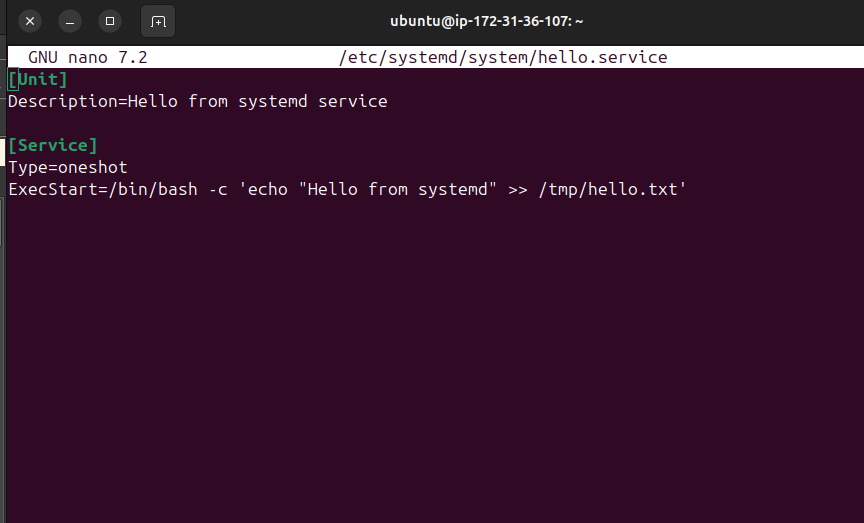
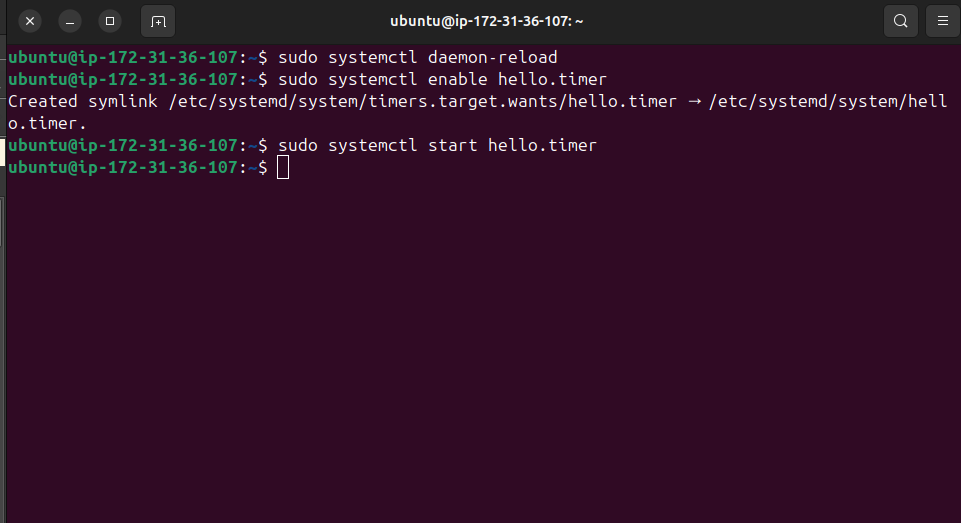

---

## 9. Logs

### 9a. Last 20 lines of system logs using `journalctl`

```bash
journalctl -n 20
```

The output shows our cron job (`/usr/bin/date >> /tmp/date_output.log`) running every minute, systemd starting/stopping `sysstat-collect.service`, and some sudo activity — basically a live view of what the system has been doing.

!

---

## 10. Network Troubleshooting

### 10a. Capture HTTP traffic on port 80 and save to `http.pcap`

```bash
sudo tcpdump -i any port 80 -w http.pcap
```

`-i any` listens on all interfaces, `port 80` filters to HTTP only, and `-w` writes the raw packets to a file. The `.pcap` file can then be opened in Wireshark for deeper analysis.


---

## Bonus

### cron vs systemd timers (one line)

`cron` is simpler and user-friendly for basic scheduled tasks, while `systemd timers` are more powerful — they support dependencies and log everything through `journalctl`.