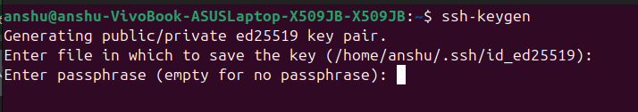

> Practised on **Ubuntu 24.04.3 LTS** — AWS EC2 instance (`ip-172-31-36-107`)  
> Date: **Wed Feb 25, 2026**

---

## Lab 1 – SSH Key Setup

1. Generate SSH key
2. Copy to remote server
3. Disable password login
4. Test login

### Step 1: Generate SSH Key

```bash
ssh-keygen
```

Generates a public/private **ed25519** key pair on the local machine.



---

### Step 2: Copy to Remote Server

Navigate to `~/.ssh` on the remote server and add the public key to `authorized_keys`:

```bash
cd ~/.ssh
ls
vim authorized_keys
```


---

### Step 3: Disable Password Login

```bash
cd /etc/ssh
ls
```


Edit `sshd_config` and set:

```
PasswordAuthentication no
KbdInteractiveAuthentication no
```


---

### Step 4: Test Login

**✅ SSH key login — Success:**

```bash
ssh -i "id_rsa" ubuntu@ec2-13-61-9-246.eu-north-1.compute.amazonaws.com
```


**❌ Password login — Blocked (as expected):**

```
Login incorrect
Login timed out
```


---

## Lab 2 – Cron Job

Create a cron job to rotate the log file.

**Open crontab editor:**

```bash
crontab -e
```

**Add:**

```cron
*/5 * * * * echo "$(date) - Test" >> /tmp/test.log
```

**Verify it's working:**

```bash
crontab -l
cat /tmp/test.log
```

Output:
```
Test
Wed Feb 25 09:15:01 UTC 2026 - Test
```


---

## Lab 3 – systemd Timer

### 1. Create a simple script

```bash
echo "Hello Systemd" >> /tmp/systemd.log
```

Create the script file:

```bash
vim hello-systemd.sh
```


Contents of `hello-systemd.sh`:

```bash
#!/bin/bash
echo "Hello Systemd $(date)" >> /tmp/systemd.log
```


Make it executable and test:

```bash
chmod +x hello-systemd.sh
./hello-systemd.sh
cat /tmp/systemd.log
```

Output:
```
Hello Systemd Wed Feb 25 08:26:25 UTC 2026
```


---

### 2. Create service file

Create `/etc/systemd/system/hello-systemd.service`:

```ini
[Unit]
Description=Hello Systemd Service

[Service]
ExecStart=/home/ubuntu/hello-systemd.sh

[Install]
WantedBy=multi-user.target
```

---

### 3. Create timer file

Create `/etc/systemd/system/hello-systemd.timer`:

```ini
[Unit]
Description=Run Hello Systemd every 2 minutes

[Timer]
OnBootSec=1min
OnUnitActiveSec=2min

[Install]
WantedBy=timers.target
```

---

### 4. Enable and verify

```bash
systemctl enable hello-systemd.timer
systemctl start hello-systemd.timer
systemctl status hello-systemd.service
cat /tmp/systemd.log
```

Log output confirms the service ran multiple times:

```
Hello Systemd Wed Feb 25 08:26:25 UTC 2026
Hello Systemd Wed Feb 25 08:40:47 UTC 2026
Hello Systemd Wed Feb 25 08:41:06 UTC 2026
Hello Systemd Wed Feb 25 08:42:44 UTC 2026
Hello Systemd Wed Feb 25 08:43:18 UTC 2026
Hello Systemd Wed Feb 25 08:45:23 UTC 2026
```


---

## Homework

Write a bash one-liner to:

**Archive:**
```
/var/log/myapp/*.log
```

**Into:**
```
myapp-YYYY-MM-DD.tar.gz
```

**Hint:** Use `tar` + `date`

**Solution:**

```bash
tar -czf myapp-$(date +%Y-%m-%d).tar.gz /var/log/myapp/*.log
```

To automate this daily with cron:

```bash
crontab -e
# Add:
0 0 * * * tar -czf /var/backups/myapp-$(date +\%Y-\%m-\%d).tar.gz /var/log/myapp/*.log
```

---

## 📌 Quick Reference

| Task | Command |
|---|---|
| Generate SSH key | `ssh-keygen` |
| Edit authorized keys | `vim ~/.ssh/authorized_keys` |
| Edit SSH daemon config | `sudo nano /etc/ssh/sshd_config` |
| View cron jobs | `crontab -l` |
| Edit cron jobs | `crontab -e` |
| Check systemd service | `systemctl status <service>` |
| Enable systemd timer | `systemctl enable --now <timer>` |
| Archive logs with date | `tar -czf myapp-$(date +%Y-%m-%d).tar.gz /path/` |

---

*Lab completed on AWS EC2 — Ubuntu 24.04.3 LTS*
